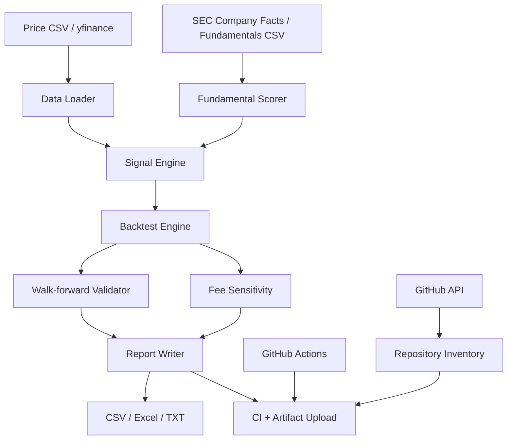
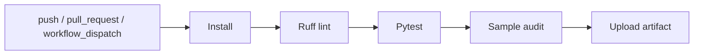

# Architecture

## 全体像

## コンポーネント

| ファイル | 役割 |
|---|---|
| `src/investment_audit/data.py` | 価格データ取得、CSV読込、合成データ生成 |
| `src/investment_audit/signals.py` | 投資シグナル生成。時系列モメンタム、移動平均、クロスセクション、ファンダメンタル |
| `src/investment_audit/backtest.py` | シグナルを1日ずらして約定し、手数料・スリッページ込みで検証 |
| `src/investment_audit/walk_forward.py` | train/test/purgeを使うウォークフォワード検証 |
| `src/investment_audit/sec_companyfacts.py` | SEC Company Facts APIからファンダメンタルJSONを取得する薄いクライアント |
| `src/investment_audit/github_repos.py` | 投資関連GitHubリポジトリの棚卸し |
| `src/investment_audit/reporting.py` | CSV / Excel / TXT レポート生成 |

## データの流れ

1. `data.py` が価格を日次closeのwide DataFrameに変換
2. `signals.py` が日次シグナルを作成
3. `backtest.py` がシグナルを1営業日シフトして損益化
4. `walk_forward.py` がインサンプルでパラメータを選び、次のアウトオブサンプルだけで評価
5. `reporting.py` が検証結果をartifact化

## ルックアヘッド対策

- 日次終値で作ったシグナルは翌営業日のリターンにだけ適用
- ウォークフォワードではtrainとtestの間にpurge期間を設定
- パラメータはtest期間に入る前に固定
- ファンダメンタルは実運用時に提出日・開示日を持つデータに変換する必要あり

## CI/CD

## Secrets

| Secret | 必須 | 用途 |
|---|---:|---|
| `GH_INVENTORY_TOKEN` | 任意 | 非公開・別orgを含むリポジトリ棚卸し |
| `SEC_USER_AGENT` | 任意 | SEC API利用時のUser-Agent |
| `MARKET_DATA_API_KEY` | 任意 | 有料データベンダーへ差し替える場合 |

## 拡張案

- 約定価格をclose-to-closeからnext-open / VWAPへ変更
- 銘柄ごとの流動性上限、出来高制約、borrow feeを追加
- ベイズ最適化ではなく、パラメータ近傍の安定性を重視するrobust objectiveを追加
- 暗号資産のfunding rate、先物basis、取引所間価格差を特徴量に追加
- 株式のSEC Company Factsから実開示日ベースのファンダメンタル時系列を作成
